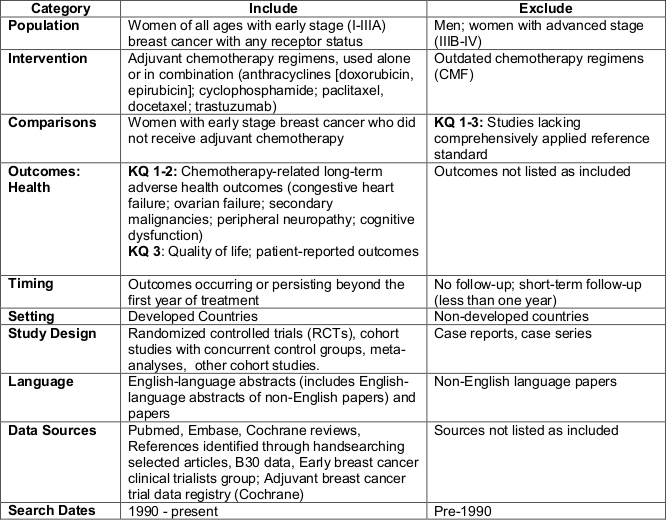

# Long term adverse events after breast cancer adjuvant chemotherapy
Benjamin Chan  

Last update: 2014-08-27 11:43:58

R version: R version 3.1.1 (2014-07-10)


# Background

From the concept paper Joy sent to NCI, *Melnikow-Ganz Concept paper with references 10-24.docx*.

>Breast cancer mortality rates have declined over the past 20 years, yet it remains the most common cancer and the second leading cause of cancer-related death in women in the US.[1] Five-year survival from stage I invasive breast cancer for women diagnosed in 2001--02 is 88%.[2] Much of the improvement in mortality is attributed to progress in early diagnosis and adjuvant treatment of early stage breast cancer (ESBC).[3] Available adjuvant therapies are recommended based on tumor characteristics (e.g., being positive or negative for hormone receptors [HR] and/or human epidermal growth factor receptor 2 [HER2]), which enable targeted use of tamoxifen and aromatase inhibitors for HR+ breast cancers and trastuzumab for HER2+tumors. Adjuvant chemotherapy regimens, most commonly containing an anthracycline (doxorubicin or epirubicin), cyclophosphamide, and a taxane, offer additional reductions in recurrence risk and enhanced survival, but these regimens are accompanied by substantial short term toxicity and risks of long term adverse effects.[4-12]  

>Limited information is available to physicians about the risks of long-term adverse outcomes ofbchemotherapy and how to factor these risks into decision making. Current clinical guidelinesbrecommend adjuvant chemotherapy to all women with operable, LN-positive breast cancer. Selectivebprovision of chemotherapy based on joint physician-patient decision making is recommended forbwomen with LN-negative ESBC taking into consideration tumor size, HR status, and HER2 status. Long-term adverse effects (e.g., leukemia, congestive heart failure, neuropathy, cognitive dysfunction, infertility) of chemotherapy are widely acknowledged,[13] but their risks are not explicitly considered in currently available risk prediction models. This limits the ability of clinicians and patients to weigh the potential harms versus benefits of adjuvant chemotherapy in treatment decision making. Randomized trials of adjuvant chemotherapy have predominantly focused on evaluating the reduction in cancer recurrence and on treatment-associated short-term adverse effects. Less attention has been given to long-term adverse effects of these cytotoxic drugs, which may have significant negative impacts on health and QOL for breast cancer survivors long after their treatment ends. The risk factors for each adverse event (eg, for anthracycline-associated congestive heart failure: age >55 years, hypertension, preexisting coronary artery disease, and previous chest or left breast irradiation[14] should be important factors to consider in decision making. Our ultimate objective is to provide clinicians and policy makers with tools to project outcomes (risk of adverse events and quality of life impacts) for use in shared decision making about adjuvant chemotherapy.  

>While some long-term adverse outcomes may manifest during or shortly after chemotherapy and then persist (amenorrhea, neuropathy, cognitive impairment),[4-12] others (congestive heart failure, secondary malignancies) may not become clinically apparent until 10 years or longer after completion of therapy.[4-12] Particularly for women at lower risk of breast cancer recurrence after primary treatment, these long-term risks represent an important consideration for decision making about chemotherapy, yet no systematic reviews or risk appraisal resources have addressed these concerns. We propose to take full advantage of existing information to address this gap through research synthesis and analysis of existing data sets. Findings from this project will provide critical data to inform models to estimate adverse event risks as part of shared decision making.  

>**The research team will conduct a series of systematic reviews to estimate the rates of long-term adverse effects of commonly used adjuvant chemotherapy regimens for breast cancer. The series of systematic reviews will address five categories of chemotherapy-related adverse events: 1) cardiac toxicity, 2) ovarian failure, 3) secondary malignancies, 4) neurotoxicity, and 5) cognitive dysfunction. Chemotherapy agents commonly used in the US for breast cancer adjuvant therapy will be included: anthracyclines (doxorubicin, epirubicin), cyclophosphamide, taxanes, and trastuzumab. Because these agents are used in combination, we will search for literature on outcomes from combined regimens. The English language literature will be comprehensively searched in Medline, Embase, the Cochrane library and Web of Science for the period of 1975 to current. In addition, references of relevant identified studies will be hand searched for additional studies, and experts in the field will be consulted to ensure that we have comprehensively identified the relevant literature. After the studies have been reviewed and abstracted, and the collection is determined to be qualitatively homogeneous, standard meta-analytic techniques will be used to estimate pooled incidence rates (per patient-year) for each category of chemotherapy-related long-term adverse event. The study-level relationship between baseline risk, treatment choice, and adverse event incidence will be explored. Random effects models will be used to allow for the estimation of between-study variation. Quantitative heterogeneity will be examined using I^2^ statistics and subgroup analysis. Publication bias will be examined using L'Abbe plots and funnel plots. If possible, meta-regression will be used to model study-level incidence rates and study-level characteristics to explain sources of heterogeneity, especially heterogeneity with respect to baseline risk and treatment choice.[15] We will also assess the feasibility of conducting an individual participant data meta-analysis. When feasible, we will calculate pooled estimates of incidence rates.**  

>We also propose to do additional analyses of data from the NASBP B 30 trial that enrolled over 5,000 patients with node positive breast cancer who were randomly assigned to three different treatment arms containing an anthracycline and a taxane.[16] These women have now been followed for a mean of 100 months, and about 69-70% remain disease-free at 10 year follow-up. Data available from the forms collected as part of the trial include:demographics, including ethnicity and health insurance status; baseline cancer treatments (surgery, reconstruction, radiation, chemotherapy, endocrine therapy), assigned chemotherapy with toxicity and dose received; treatment toxicity and adverse events; baseline BMI; interval cancer recurrence and new cancers at follow-up; ongoing additional cancer therapy (at follow-up); and QOL measured with multiple scales, including the FACT-B; symptoms; sexual functioning; menstrual history/amenorrhea both observed out to 24 months.[17] Additional queries from forms available in the NSABP database will be undertaken, as proof of principle, that such information may be retrieved from clinical trials databases to enhance our understanding of adjuvant chemotherapy treatment morbidities. These findings will supplement those from the systematic review and add to our understanding of the frequency and impact of adverse events resulting from contemporary adjuvant chemotherapy.  

>This project will take maximal advantage of existing data to advance knowledge on the balance of benefits and harms resulting from the use of adjuvant chemotherapy for ESBC. Our project will be the first that we know of to conduct a systematic review of the long-term harms of adjuvant chemotherapy for breast cancer. Such a review is critical not only to define what we currently know about treatment harms, but perhaps more importantly, to identify gaps in existing knowledge that will guide future research. We will supplement our review of the literature with new secondary analyses of data from the NSABP B-30 trial. Data from this work will inform future development of a user-friendly, patient-level model to assist patients and clinicians with informed shared decision making about adjuvant chemotherapy for early stage breast cancer.


# Key questions

Taken from the key questions document, *NCI Systematic Review Key Questions_Final.docx*.

## Scope
What is the long-term adverse health and quality of life effects of the most commonly used breast cancer adjuvant chemotherapy regimens? 

## Key Questions to be Systematically Reviewed 
In the target population of women with early stage breast cancer(a): 

1. What is the effect of adjuvant chemotherapy(b) on long-term adverse health outcomes(c) and how does it differ by age, race-ethnicity, and risk factor(d)? 
2. What is the synergistic effect of the combination of adjuvant chemotherapy(b) with trastuzumab on long-term adverse health outcomes(c) and how does it differ by age and risk factors(d)? 
3. What is the effect of adjuvant chemotherapy(b) on patient quality of life and other patient-reported outcomes? How does it differ by age, race-ethnicity and risk factors?

Notes:

(a) Excludes men and women with advanced stage (IIIB-IV) breast cancer  
(b) Adjuvant chemotherapy regimens include anthracyclines (doxorubicin, epirubicin), cyclophosphamide, paclitaxel, docetaxel, and trastuzumab  
(c) Long term is defined as persisting beyond 2 years from diagnosis; adverse health outcomes include congestive heart failure, ovarian failure, secondary malignancies, peripheral neuropathy, and cognitive dysfunction.  
(d) Risk factors include: age, race/ethnicity, use of other medications, dose and side of radiation to chest, pre-existing chronic conditions: diabetes, depression, heart disease, dementia  

## Contextual Question

1. Among women with left-sided breast cancer, what is the impact of radiation therapy to the breast on long-term adverse health outcomes(c)? 

## Research Approach 




--------------------------------------------------------


# Analysis

Load required packages


```r
require(metafor)
```

```
## Loading required package: metafor
## Loading required package: Formula
## Loading required package: Matrix
## 
## Loading 'metafor' package (version 1.9-4). For an overview 
## and introduction to the package please type: help(metafor).
```

```r
# require(lme4)
```

Recreate the analysis from Nelson (2009); Screening for Breast Cancer: An Update for the U.S. Preventive Services Task Force; Ann Intern Med. 2009;151:727-737.

Here's the dataset from the figure on page 730.


```r
study <- c("HIP", "Kopparberg", "CNBSS-1", "Malmö", "Stockholm", "Östergötland", "Gothenberg", "Age")
year <- c(1986, 1995, 2002, 2002, 2002, 2002, 2003, 2006)
deaths1 <- c(64, 22, 105, 53, 34, 31, 34, 105)
n1 <- c(13740, 9582, 25214, 13568, 14303, 10285, 11724, 53884)
deaths2 <- c(82, 16, 108, 66, 13, 30, 59, 251)
n2 <- c(13740, 5031, 25216, 12279, 8021, 10459, 14217, 106956)
D <- data.frame(study, year, deaths1, n1, deaths2, n2)
print(D)
```

```
##            study year deaths1    n1 deaths2     n2
## 1            HIP 1986      64 13740      82  13740
## 2     Kopparberg 1995      22  9582      16   5031
## 3        CNBSS-1 2002     105 25214     108  25216
## 4         Malmö 2002      53 13568      66  12279
## 5      Stockholm 2002      34 14303      13   8021
## 6 Östergötland 2002      31 10285      30  10459
## 7     Gothenberg 2003      34 11724      59  14217
## 8            Age 2006     105 53884     251 106956
```

Fit a random effects model for the relative risk.


```r
RR <- rma(measure="RR", data=D, ai=deaths1, n1i=n1, ci=deaths2, n2i=n2)
summary(RR)
```

```
## 
## Random-Effects Model (k = 8; tau^2 estimator: REML)
## 
##   logLik  deviance       AIC       BIC      AICc  
##   1.3327   -2.6655    1.3345    1.2263    4.3345  
## 
## tau^2 (estimated amount of total heterogeneity): 0.0000 (SE = 0.0155)
## tau (square root of estimated tau^2 value):      0.0005
## I^2 (total heterogeneity / total variability):   0.00%
## H^2 (total variability / sampling variability):  1.00
## 
## Test for Heterogeneity: 
## Q(df = 7) = 6.5635, p-val = 0.4757
## 
## Model Results:
## 
## estimate       se     zval     pval    ci.lb    ci.ub          
##  -0.1610   0.0634  -2.5408   0.0111  -0.2853  -0.0368        * 
## 
## ---
## Signif. codes:  0 '***' 0.001 '**' 0.01 '*' 0.05 '.' 0.1 ' ' 1
```

```r
predict(RR, transf=exp)
```

```
##    pred  ci.lb  ci.ub  cr.lb  cr.ub
##  0.8513 0.7518 0.9639 0.7518 0.9639
```

Plot model diagnostics.


```r
plot(RR)
```

 

Plot a L'Abbe plot.


```r
labbe(RR)
```

 

Plot summary forest plot.


```r
forest(RR, slab=study, transf=exp, ref=1)
```

 


Fit a random effects model for the relative difference.


```r
RD <- rma(measure="RD", data=D, ai=deaths1, n1i=n1, ci=deaths2, n2i=n2)
summary(RD)
```

```
## 
## Random-Effects Model (k = 8; tau^2 estimator: REML)
## 
##   logLik  deviance       AIC       BIC      AICc  
##  40.3055  -80.6110  -76.6110  -76.7192  -73.6110  
## 
## tau^2 (estimated amount of total heterogeneity): 0.0000 (SE = 0.0000)
## tau (square root of estimated tau^2 value):      0.0002
## I^2 (total heterogeneity / total variability):   13.32%
## H^2 (total variability / sampling variability):  1.15
## 
## Test for Heterogeneity: 
## Q(df = 7) = 8.6738, p-val = 0.2769
## 
## Model Results:
## 
## estimate       se     zval     pval    ci.lb    ci.ub          
##  -0.0004   0.0002  -1.8384   0.0660  -0.0008   0.0000        . 
## 
## ---
## Signif. codes:  0 '***' 0.001 '**' 0.01 '*' 0.05 '.' 0.1 ' ' 1
```

```r
predict(RD)
```

```
##     pred     se   ci.lb  ci.ub   cr.lb  cr.ub
##  -0.0004 0.0002 -0.0008 0.0000 -0.0010 0.0002
```

Plot model diagnostics.


```r
plot(RD)
```

 

Plot a L'Abbe plot.


```r
labbe(RD)
```

 

Plot summary forest plot.


```r
forest(RD, slab=study, digits=4)
```

 
