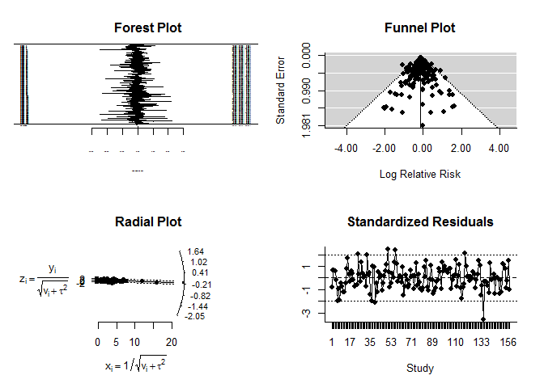
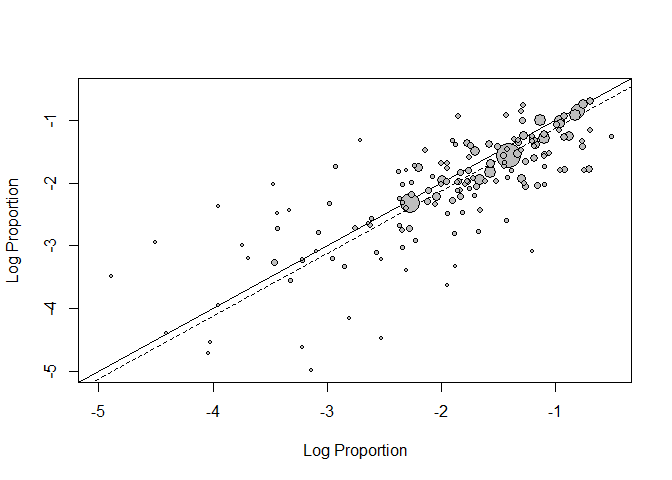
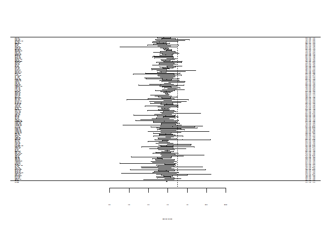
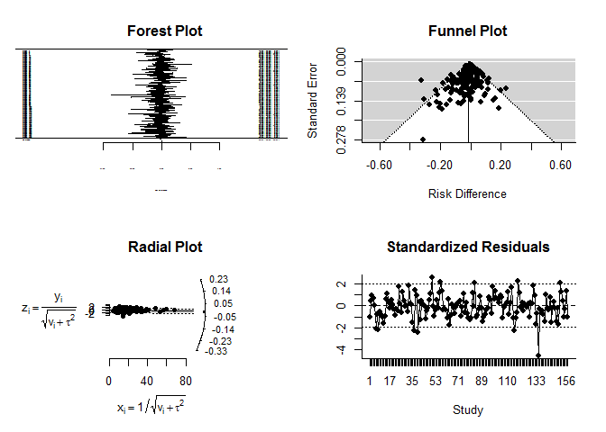
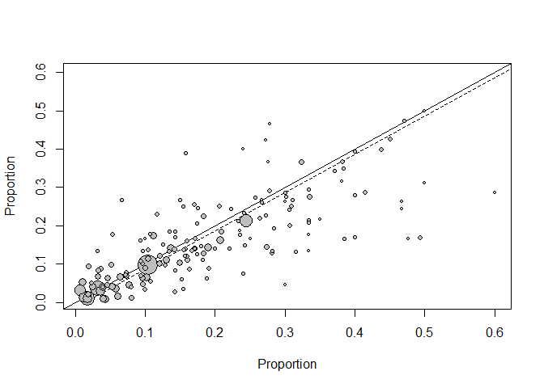
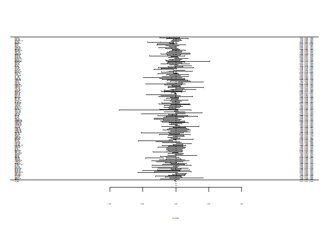

# Long term adverse events after breast cancer adjuvant chemotherapy
Benjamin Chan  

Last update: 2014-09-10 11:07:33

R version 3.1.1 (2014-07-10)


Recreate the analysis from [Mishanina](http://www.ncbi.nlm.nih.gov/pubmed/24778358) (2014); Use of labour induction and risk of cesarean delivery: a systematic review and meta-analysis.; CMAJ. 2014 Jun 10;186(9):665-73. doi: 10.503/cmaj.130925. Epub 2014 Apr 28. Review. PMID: 24778358

The data is from [Appendix 5](http://www.cmaj.ca/content/suppl/2014/04/28/cmaj.130925.DC1/labour-khan-appendix_5.pdf).


```r
D <- read.csv("labour-khan-appendix_5.csv", header=FALSE)
names(D) <- c("study", "yInt", "nInt", "yCntl", "nCntl")
denominator <- 1000
D$rateInt  <- denominator * D$yInt  / D$nInt
D$rateCntl <- denominator * D$yCntl / D$nCntl
D$rr <- D$rateInt / D$rateCntl
D$rd <- D$rateInt -D$rateCntl
head(D)
```

```
##                study yInt nInt yCntl nCntl rateInt rateCntl     rr      rd
## 1         Akyol 1999   10   52    21    74  192.31   283.78 0.6777  -91.48
## 2       Al Malt 1995   12   49    12    54  244.90   222.22 1.1020   22.68
## 3       Alcalay 1996    3   74     2    80   40.54    25.00 1.6216   15.54
## 4 Alcoseba·Lim 1992    4   65     3    65   61.54    46.15 1.3333   15.38
## 5        Allott 1993    4   99     5    96   40.40    52.08 0.7758  -11.68
## 6         Asher 2009   10   59    12    30  169.49   400.00 0.4237 -230.51
```


# Using random-effects model


Load required packages


```r
require(metafor)
```

```
## Loading required package: metafor
## Loading required package: Formula
## Loading required package: Matrix
## 
## Loading 'metafor' package (version 1.9-4). For an overview 
## and introduction to the package please type: help(metafor).
```

```r
# require(lme4)
```

Fit a random effects model for the relative risk.


```r
RR <- rma(measure="RR", data=D, ai=yInt, n1i=nInt, ci=yCntl, n2i=nCntl)
summary(RR)
```

```
## 
## Random-Effects Model (k = 157; tau^2 estimator: REML)
## 
##    logLik   deviance        AIC        BIC       AICc  
## -103.6410   207.2819   211.2819   217.3816   211.3603  
## 
## tau^2 (estimated amount of total heterogeneity): 0 (SE = 0.0048)
## tau (square root of estimated tau^2 value):      0
## I^2 (total heterogeneity / total variability):   0.00%
## H^2 (total variability / sampling variability):  1.00
## 
## Test for Heterogeneity: 
## Q(df = 156) = 145.9174, p-val = 0.7073
## 
## Model Results:
## 
## estimate       se     zval     pval    ci.lb    ci.ub          
##  -0.1247   0.0254  -4.9032   <.0001  -0.1746  -0.0749      *** 
## 
## ---
## Signif. codes:  0 '***' 0.001 '**' 0.01 '*' 0.05 '.' 0.1 ' ' 1
```

```r
predict(RR, transf=exp)
```

```
##    pred  ci.lb  ci.ub  cr.lb  cr.ub
##  0.8828 0.8398 0.9279 0.8398 0.9279
```

Plot model diagnostics.


```r
plot(RR)
```

 

Plot a L'Abbe plot.


```r
labbe(RR)
```

 

Plot summary forest plot.


```r
forest(RR, slab=D$study, atransf=exp, ref=1)
```

 

Fit a random effects model for the relative difference.


```r
RD <- rma(measure="RD", data=D, ai=yInt, n1i=nInt, ci=yCntl, n2i=nCntl)
summary(RD)
```

```
## 
## Random-Effects Model (k = 157; tau^2 estimator: REML)
## 
##    logLik   deviance        AIC        BIC       AICc  
##  192.0801  -384.1603  -380.1603  -374.0606  -380.0819  
## 
## tau^2 (estimated amount of total heterogeneity): 0.0001 (SE = 0.0002)
## tau (square root of estimated tau^2 value):      0.0121
## I^2 (total heterogeneity / total variability):   7.59%
## H^2 (total variability / sampling variability):  1.08
## 
## Test for Heterogeneity: 
## Q(df = 156) = 185.9364, p-val = 0.0511
## 
## Model Results:
## 
## estimate       se     zval     pval    ci.lb    ci.ub          
##  -0.0130   0.0039  -3.3533   0.0008  -0.0206  -0.0054      *** 
## 
## ---
## Signif. codes:  0 '***' 0.001 '**' 0.01 '*' 0.05 '.' 0.1 ' ' 1
```

```r
predict(RD)
```

```
##     pred     se   ci.lb   ci.ub   cr.lb  cr.ub
##  -0.0130 0.0039 -0.0206 -0.0054 -0.0379 0.0119
```

Plot model diagnostics.


```r
plot(RD)
```

 

Plot a L'Abbe plot.


```r
labbe(RD)
```

 

Plot summary forest plot.


```r
forest(RD, slab=D$study, digits=4)
```

 


# Using JAGS


Load `R2jags` and `ggmcmc`.


```r
require(R2jags, quietly=TRUE)
```

```
## Loading required package: coda
## Loading required package: lattice
## Linked to JAGS 3.4.0
## Loaded modules: basemod,bugs
## 
## Attaching package: 'R2jags'
## 
## The following object is masked from 'package:coda':
## 
##     traceplot
```

```r
require(ggmcmc, quietly=TRUE)
```

Specify the model using JAGS syntax.
Write the model to a text file.


```r
cat("model
{
  # Likelihood
  for( i in 1 : n ) {
    z[i] ~ dnorm(0, 1)
    logit(pInt[i] ) <- alpha + beta + sigma * z[i]
    logit(pCntl[i]) <- alpha        + sigma * z[i]
    yInt[i]  ~ dbin(pInt[i] , nInt[i] )
    yCntl[i] ~ dbin(pCntl[i], nCntl[i])
  }
  # Priors
  alpha ~ dnorm(0, 1.0E-1)
  beta  ~ dnorm(0, 1.0E-1)
  sigma ~ dnorm(1, 1.0E-1) I(0, )
  # sigma ~ dgamma(0.001, 0.001)
}
",
file="modelMetaAnalysis.txt")
```

Prepare the data for JAGS.
`R2jags` requires the data object to be a list.


```r
D2 <- list(n=nrow(D), yInt=D$yInt, nInt=D$nInt, yCntl=D$yCntl, nCntl=D$nCntl)
```

Initialize the parameters.


```r
# inits <- function() {list("alpha"=rnorm(1), "beta"=rnorm(1), "sigma"=runif(1), "z"=rnorm(nrow(D)))}
inits <- NULL
```

Specify the parameters to track.


```r
params <- c("alpha", "beta", "sigma")
```

Set the random number seed.


```r
set.seed(as.numeric(as.Date("2014-08-27")))
```

Run the model.
**Don't use `jags()`;** it's slow.


```r
system.time(M <- jags(D2, inits, params, model.file="modelMetaAnalysis.txt", n.iter=30E3))
```

**Use `jags.parallel()` instead;** it's faster.
`jags.parallel` requires some counterintuitive specification.
See this tip on [Stackoverflow](http://stackoverflow.com/a/20156127).


```r
n <- nrow(D)
yInt <- D$yInt
nInt <- D$nInt
yCntl <- D$yCntl
nCntl <- D$nCntl
D3 <- list("n", "yInt", "nInt", "yCntl", "nCntl")
system.time(M <- jags.parallel(D3, inits, params, model.file="modelMetaAnalysis.txt", n.chains=3, n.iter=30E3))
```

```
##    user  system elapsed 
##    0.01    0.02   49.07
```

Convert the JAGS object to an MCMC object.
Also, convert the MCMC object to a ggs object.


```r
Mmcmc <- as.mcmc(M)
Mggs <- ggs(as.mcmc(M))
```

Check for convergence.


```r
ggs_traceplot(Mggs)
```

 

```r
ggs_autocorrelation(Mggs)
```

 

```r
ggs_compare_partial(Mggs)
```

 

**Convergence looks good.**
So, show the model output.


```r
M
```

```
## Inference for Bugs model at "modelMetaAnalysis.txt", fit using jags,
##  3 chains, each with 30000 iterations (first 15000 discarded), n.thin = 15
##  n.sims = 3000 iterations saved
##           mu.vect sd.vect     2.5%      25%      50%      75%    97.5%
## alpha      -1.665   0.074   -1.810   -1.715   -1.665   -1.614   -1.522
## beta       -0.161   0.032   -0.223   -0.183   -0.161   -0.139   -0.099
## sigma       0.845   0.058    0.739    0.806    0.842    0.881    0.969
## deviance 1482.786  17.807 1450.105 1470.659 1481.967 1494.005 1519.831
##           Rhat n.eff
## alpha    1.001  2900
## beta     1.001  2500
## sigma    1.003  1200
## deviance 1.001  3000
## 
## For each parameter, n.eff is a crude measure of effective sample size,
## and Rhat is the potential scale reduction factor (at convergence, Rhat=1).
## 
## DIC info (using the rule, pD = var(deviance)/2)
## pD = 158.6 and DIC = 1641.4
## DIC is an estimate of expected predictive error (lower deviance is better).
```

```r
ggs_density(Mggs)
```

 

Combine the MCMC chains.
Calculate some useful output from the model.


```r
Mdf <- rbind(data.frame(chain = 1, Mmcmc[[1]]),
             data.frame(chain = 2, Mmcmc[[2]]),
             data.frame(chain = 3, Mmcmc[[3]]))
Mdf$predInt <- exp(Mdf$alpha + Mdf$beta) / (1 + exp(Mdf$alpha + Mdf$beta))
Mdf$predCntl <- exp(Mdf$alpha) / (1 + exp(Mdf$alpha))
Mdf$rateInt <- Mdf$predInt * denominator
Mdf$rateCntl <- Mdf$predCntl * denominator
Mdf$rateDiff <- Mdf$rateInt - Mdf$rateCntl
Mdf$nns <- 1 / (Mdf$predCntl - Mdf$predInt)
```

Summarize.


```r
Mgg <- melt(Mdf, id.vars=c("chain"), measure.vars=c("rateInt", "rateCntl", "rateDiff", "nns"))
Mgg$varLabel <- factor(Mgg$variable, labels=c("Intervention", "Control", "Difference", "NNS"))
ggplot(Mgg[Mgg$varLabel %in% c("Intervention", "Control"), ], aes(x=value, fill=varLabel)) +
  geom_density(alpha=1/2) +
  scale_x_continuous(sprintf("Rate per %s", format(denominator, big.mark=","))) +
  scale_y_continuous("Density") +
  scale_fill_discrete("")
```

 

```r
ggplot(Mgg[Mgg$varLabel == "Difference", ], aes(x=value)) +
  geom_density(alpha=1/2, fill="grey") +
  scale_x_continuous(sprintf("Rate difference per %s", format(denominator, big.mark=","))) +
  scale_y_continuous("Density") +
  scale_fill_discrete("") +
  geom_vline(xIntercept = 0)
```

 

Save the JAGS objects.


```r
modelJAGS <- list(metadata = list(timestamp = Sys.time(),
                                  R = R.version.string,
                                  R2jags = packageVersion("R2jags")),
                  jags = M,
                  chains = Mdf)
save(modelJAGS, file="modelJAGS.RData")
```
