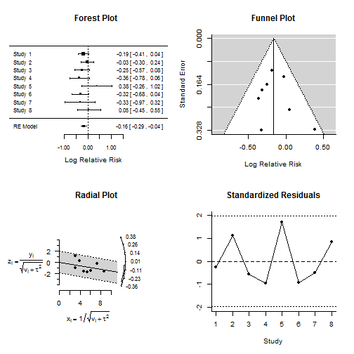
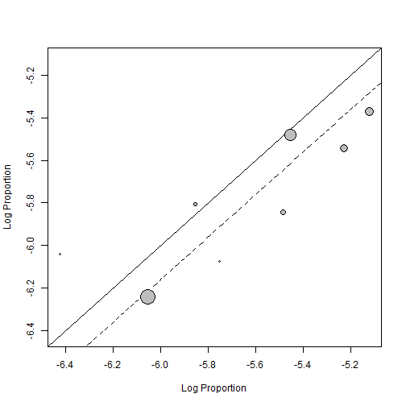
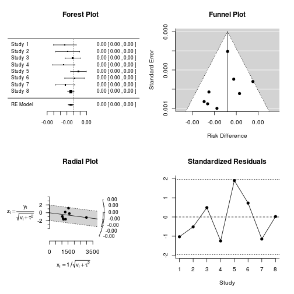
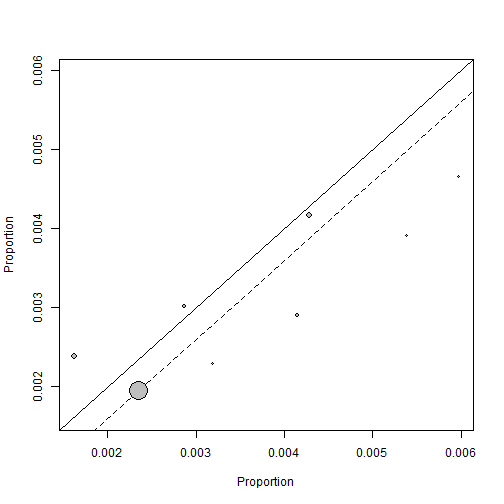
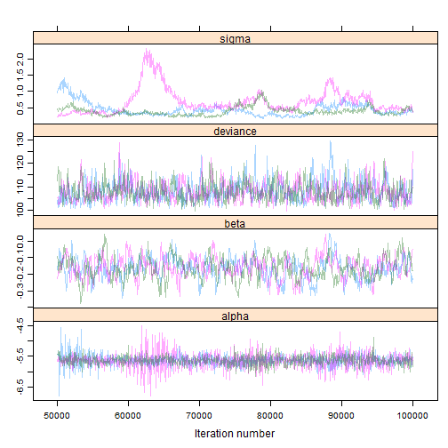
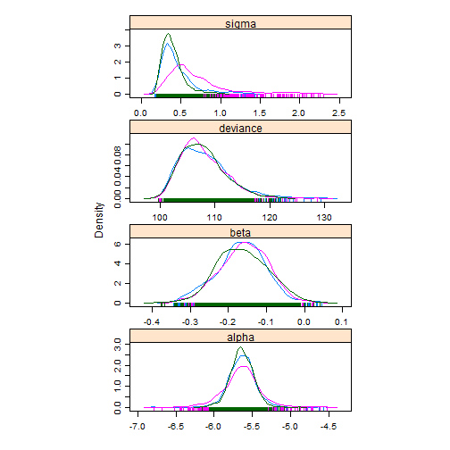

Last update: 2014-08-27 22:21:34

R version: R version 3.0.2 (2013-09-25)


# Using random-effects model

Load required packages


```r
require(metafor)
```

```
## Loading required package: metafor
```

```
## Warning: package 'metafor' was built under R version 3.0.3
```

```
## Loading required package: Formula Loading required package: Matrix Loading
## required package: lattice
## 
## Loading 'metafor' package (version 1.9-4). For an overview and
## introduction to the package please type: help(metafor).
```

```r
# require(lme4)
```


Recreate the analysis from Nelson (2009); Screening for Breast Cancer: An Update for the U.S. Preventive Services Task Force; Ann Intern Med. 2009;151:727-737.

Here's the dataset from the figure on page 730.


```r
study <- c("AGE", "CNBSS-1", "HIP", "Gothenburg", "Stockholm", "Malmo", "Kopparberg", 
    "Ostergotland")
yInt <- c(105, 105, 64, 34, 34, 53, 22, 31)
nInt <- c(53884, 25214, 13740, 11724, 14303, 13568, 9582, 10285)
pyInt <- c(578390, 282606, 192360, NA, 203000, 184000, 124566, 172000)
yCntl <- c(251, 108, 82, 59, 13, 66, 16, 30)
nCntl <- c(106956, 25216, 13740, 14217, 8021, 12279, 5031, 10459)
pyCntl <- c(1149380, 282575, 192360, NA, 117000, 160000, 65403, 176000)
n <- 10000
rateInt <- n * yInt/nInt
rateCntl <- n * yCntl/nCntl
rr <- rateInt/rateCntl
rd <- rateInt - rateCntl
nns <- 1/((yCntl/nCntl) - (yInt/nInt))
D <- data.frame(study, yInt, nInt, pyInt, rateInt, yCntl, nCntl, pyCntl, rateCntl, 
    rr, rd, nns)
D
```

```
##          study yInt  nInt  pyInt rateInt yCntl  nCntl  pyCntl rateCntl
## 1          AGE  105 53884 578390   19.49   251 106956 1149380    23.47
## 2      CNBSS-1  105 25214 282606   41.64   108  25216  282575    42.83
## 3          HIP   64 13740 192360   46.58    82  13740  192360    59.68
## 4   Gothenburg   34 11724     NA   29.00    59  14217      NA    41.50
## 5    Stockholm   34 14303 203000   23.77    13   8021  117000    16.21
## 6        Malmo   53 13568 184000   39.06    66  12279  160000    53.75
## 7   Kopparberg   22  9582 124566   22.96    16   5031   65403    31.80
## 8 Ostergotland   31 10285 172000   30.14    30  10459  176000    28.68
##       rr      rd     nns
## 1 0.8303  -3.981  2511.7
## 2 0.9723  -1.186  8428.7
## 3 0.7805 -13.100   763.3
## 4 0.6988 -12.499   800.0
## 5 1.4667   7.564 -1322.1
## 6 0.7267 -14.688   680.8
## 7 0.7219  -8.843  1130.8
## 8 1.0508   1.458 -6860.8
```


Fit a random effects model for the relative risk.


```r
RR <- rma(measure = "RR", data = D, ai = yInt, n1i = nInt, ci = yCntl, n2i = nCntl)
summary(RR)
```

```
## 
## Random-Effects Model (k = 8; tau^2 estimator: REML)
## 
##   logLik  deviance       AIC       BIC      AICc  
##   1.3327   -2.6655    1.3345    1.2263    4.3345  
## 
## tau^2 (estimated amount of total heterogeneity): 0.0000 (SE = 0.0155)
## tau (square root of estimated tau^2 value):      0.0005
## I^2 (total heterogeneity / total variability):   0.00%
## H^2 (total variability / sampling variability):  1.00
## 
## Test for Heterogeneity: 
## Q(df = 7) = 6.5635, p-val = 0.4757
## 
## Model Results:
## 
## estimate       se     zval     pval    ci.lb    ci.ub          
##  -0.1610   0.0634  -2.5408   0.0111  -0.2853  -0.0368        * 
## 
## ---
## Signif. codes:  0 '***' 0.001 '**' 0.01 '*' 0.05 '.' 0.1 ' ' 1
```

```r
predict(RR, transf = exp)
```

```
##    pred  ci.lb  ci.ub  cr.lb  cr.ub
##  0.8513 0.7518 0.9639 0.7518 0.9639
```


Plot model diagnostics.


```r
plot(RR)
```

 


Plot a L'Abbe plot.


```r
labbe(RR)
```

 


Plot summary forest plot.


```r
forest(RR, slab = study, transf = exp, ref = 1)
```

 


Fit a random effects model for the relative difference.


```r
RD <- rma(measure = "RD", data = D, ai = yInt, n1i = nInt, ci = yCntl, n2i = nCntl)
summary(RD)
```

```
## 
## Random-Effects Model (k = 8; tau^2 estimator: REML)
## 
##   logLik  deviance       AIC       BIC      AICc  
##  40.3055  -80.6110  -76.6110  -76.7192  -73.6110  
## 
## tau^2 (estimated amount of total heterogeneity): 0.0000 (SE = 0.0000)
## tau (square root of estimated tau^2 value):      0.0002
## I^2 (total heterogeneity / total variability):   13.32%
## H^2 (total variability / sampling variability):  1.15
## 
## Test for Heterogeneity: 
## Q(df = 7) = 8.6738, p-val = 0.2769
## 
## Model Results:
## 
## estimate       se     zval     pval    ci.lb    ci.ub          
##  -0.0004   0.0002  -1.8384   0.0660  -0.0008   0.0000        . 
## 
## ---
## Signif. codes:  0 '***' 0.001 '**' 0.01 '*' 0.05 '.' 0.1 ' ' 1
```

```r
predict(RD)
```

```
##     pred     se   ci.lb  ci.ub   cr.lb  cr.ub
##  -0.0004 0.0002 -0.0008 0.0000 -0.0010 0.0002
```


Plot model diagnostics.


```r
plot(RD)
```

 


Plot a L'Abbe plot.


```r
labbe(RD)
```

 


Plot summary forest plot.


```r
forest(RD, slab = study, digits = 4)
```

 


# Using JAGS

Load `R2jags`.


```r
require(R2jags, quietly = TRUE)
```

```
## Warning: package 'R2jags' was built under R version 3.0.3 Warning: package
## 'rjags' was built under R version 3.0.3
```

```
## Loading required package: coda
```

```
## Warning: package 'coda' was built under R version 3.0.3
```

```
## Linked to JAGS 3.4.0 Loaded modules: basemod,bugs
## 
## Attaching package: 'R2jags'
## 
## The following object is masked from 'package:coda':
## 
## traceplot
```


Specify the model using JAGS syntax.
Write the model to a text file.


```r
cat("\nmodel\n{\n  for( i in 1 : n ) {\n    z[i] ~ dnorm(0, 1)\n    logit(pInt[i] ) <- alpha + beta + sigma * z[i]\n    logit(pCntl[i]) <- alpha        + sigma * z[i]\n    yInt[i]  ~ dbin(pInt[i] , nInt[i] )\n    yCntl[i] ~ dbin(pCntl[i], nCntl[i])\n  }\n  alpha ~ dnorm(-5.0, 1.0E-1)\n  beta  ~ dnorm(0.0, 1.0E-1)\n  sigma ~ dnorm( 0.5, 1.0E-1) I(0, )\n  # sigma ~ dgamma(0.001, 0.001)\n}\n", 
    file = "modelMetaAnalysis.txt")
```


Prepare the data for JAGS.
`R2jags` requires the data object to be a list.


```r
DJags <- list(n = nrow(D), yInt = D$yInt, nInt = D$nInt, yCntl = D$yCntl, nCntl = D$nCntl)
```


Initialize the parameters.


```r
inits <- function() {
    list(alpha = 0, beta = 0, sigma = 0, z = rep(0, nrow(D)))
}
```


Specify the parameters to track.


```r
params <- c("alpha", "beta", "sigma")
```


Set the random number seed.


```r
set.seed(as.numeric(as.Date("2014-08-27")))
```


Run the model.


```r
system.time(M <- jags(DJags, inits, params, model.file = "modelMetaAnalysis.txt", 
    n.iter = 1e+05))
```

```
## module glm loaded
```

```
## Compiling model graph
##    Resolving undeclared variables
##    Allocating nodes
##    Graph Size: 90
## 
## Initializing model
```

```
##    user  system elapsed 
##   19.65    0.03   22.25
```


I can't figure out what's wrong with `jags.parallel`.
It returns this message,

> `Error in get(name, envir = envir) : invalid first argument`


```r
M <- jags.parallel(DJags, inits, params, model.file = "modelMetaAnalysis.txt")
```


Check for convergence.
The 3 MCMC chains should overlap and not diverge.


```r
Mmcmc <- as.mcmc(M)
xyplot(Mmcmc, alpha = 1/M$BUGSoutput$n.chains)
```

 


Show the model output.


```r
M
```

```
## Inference for Bugs model at "modelMetaAnalysis.txt", fit using jags,
##  3 chains, each with 1e+05 iterations (first 50000 discarded), n.thin = 50
##  n.sims = 3000 iterations saved
##          mu.vect sd.vect    2.5%     25%     50%     75%   97.5%  Rhat
## alpha     -5.637   0.199  -6.034  -5.746  -5.636  -5.527  -5.251 1.048
## beta      -0.162   0.065  -0.292  -0.205  -0.161  -0.117  -0.038 1.003
## sigma      0.507   0.289   0.222   0.327   0.424   0.578   1.340 1.347
## deviance 107.887   4.215 101.563 104.774 107.256 110.302 117.729 1.004
##          n.eff
## alpha     3000
## beta       720
## sigma       10
## deviance  2100
## 
## For each parameter, n.eff is a crude measure of effective sample size,
## and Rhat is the potential scale reduction factor (at convergence, Rhat=1).
## 
## DIC info (using the rule, pD = var(deviance)/2)
## pD = 8.9 and DIC = 116.8
## DIC is an estimate of expected predictive error (lower deviance is better).
```

```r
densityplot(Mmcmc)
```

 

