# Long term adverse events after breast cancer adjuvant chemotherapy
Benjamin Chan  


# Background

See [README.md](https://github.com/benjamin-chan/AEAfterBreastCaACT/blob/master/README.md).


# Preliminaries

Check for and load packages.
Source the `loadPkg` function.
Source is found at this [gist](https://gist.githubusercontent.com/benjamin-chan/3b59313e8347fffea425/raw/0a274c7211228ad9d4134e51aa3ac3cbe87ba28a/loadPkg.R).


```
## Installing package into '/home/rstudio/R/x86_64-pc-linux-gnu-library/3.2'
## (as 'lib' is unspecified)
```

```
## 
## The downloaded source packages are in
## 	'/tmp/RtmpqNJtGk/downloaded_packages'
```

```
## Loading required package: data.table
## Loading required package: reshape2
## Loading required package: metafor
## Loading required package: Matrix
## 
## Attaching package: 'Matrix'
## 
## The following objects are masked from 'package:base':
## 
##     crossprod, tcrossprod
## 
## Loading 'metafor' package (version 1.9-7). For an overview 
## and introduction to the package please type: help(metafor).
## Loading required package: R2jags
## Loading required package: rjags
## Loading required package: coda
## Loading required package: lattice
## Linked to JAGS 3.4.0
## Loaded modules: basemod,bugs
## 
## Attaching package: 'R2jags'
## 
## The following object is masked from 'package:coda':
## 
##     traceplot
## 
## Loading required package: Rcpp
## Loading required package: dplyr
## 
## Attaching package: 'dplyr'
## 
## The following objects are masked from 'package:data.table':
## 
##     between, last
## 
## The following objects are masked from 'package:stats':
## 
##     filter, lag
## 
## The following objects are masked from 'package:base':
## 
##     intersect, setdiff, setequal, union
## 
## Loading required package: ggplot2
## Loading required package: ggmcmc
## Loading required package: tidyr
## 
## Attaching package: 'tidyr'
## 
## The following object is masked from 'package:Matrix':
## 
##     expand
## 
## Loading required package: GGally
## 
## Attaching package: 'GGally'
## 
## The following object is masked from 'package:dplyr':
## 
##     nasa
```


Point the `path` object to your local repository.


```r
# path <- getwd()
path <- "~/Dropbox"  # use the Dropbox folder when using an EC2 session
```


# Create datasets

* `id` is Endnote number
* `study` uses *Author (year)* format
* `y1` is numerator for the intervention group
* `n1` is denominator for the intervention group
* `y0` is numerator for the control group
* `n0` is denominator for the control group


## Secondary malignancies

```
From: Ganz, Patricia, M.D. [mailto:PGanz@mednet.ucla.edu] 
Sent: Friday, April 24, 2015 5:09 PM
To: Benjamin Chan; Joy Melnikow (jamelnikow@ucdavis.edu); Meghan Soulsby (masoulsby@ucdavis.edu); Freedman, Andrew (NIH/NCI) [E] (freedmaa@mail.nih.gov)
Subject: RE: NCI - secondary malignancies abstraction

Hi Ben,
I can help with this.  There are several main groups of therapies.  Here are some suggestions:
Anthracycline (doxorubicin, epirubicin) vs. non-anthracycline
Cyclophosphamide containing (Cytoxan) which is in almost all regimens
Taxane (paclitaxel, docetaxel) vs. non-taxane containing regimens
```


```r
options(stringsAsFactors=FALSE)
DStudies <- rbind(data.frame(id=961, study="Fisher (1999)"),
                  data.frame(id=970, study="Bergh (2000)"),
                  data.frame(id=974, study="Chaplain (2000)"))
D <- data.table(outcome="Secondary malignancies", DStudies)
D <- rbind(data.table(type="Acute myeloid leukemia", D),
           data.table(type="Myelodysplastic syndrome", D),
           data.table(type="First reported treatment failure", D))
D <- D[type == "Acute myeloid leukemia" & study == "Fisher (1999)",
       `:=` (drug = "Anthracycline",
             y1 = 5 + 6,
             n1 = 845 + 847,
             y0 = 15,
             n0 = 2534)]
D <- D[type == "Acute myeloid leukemia" & study == "Bergh (2000)",
       `:=` (drug = "",
             y1 = 3,
             n1 = 251,
             y0 = NA,
             n0 = NA)]
D <- D[type == "Acute myeloid leukemia" & study == "Chaplain (2000)",
       `:=` (drug = "",
             y1 = NA,
             n1 = NA,
             y0 = NA,
             n0 = NA)]
```


## Example dataset

**Do not create.** Only use as a template.

Recreate the analysis from [Mishanina](http://www.ncbi.nlm.nih.gov/pubmed/24778358) (2014); Use of labour induction and risk of cesarean delivery: a systematic review and meta-analysis.; CMAJ. 2014 Jun 10;186(9):665-73. doi: 10.503/cmaj.130925. Epub 2014 Apr 28. Review. PMID: 24778358

The data is from [Appendix 5](http://www.cmaj.ca/content/suppl/2014/04/28/cmaj.130925.DC1/labour-khan-appendix_5.pdf).


```r
D <- data.table(read.csv("labour-khan-appendix_5.csv", header=FALSE))
setnames(D, names(D), c("study", "yInt", "nInt", "yCntl", "nCntl"))
denominator <- 1000
D <- D[,
       `:=` (rateInt  = denominator * yInt  / nInt,
             rateCntl = denominator * yCntl / nCntl)]
D <- D[,
       `:=` (rr = rateInt / rateCntl,
             rd = rateInt - rateCntl)]
D
```

```
##                  study yInt nInt yCntl nCntl   rateInt  rateCntl        rr
##   1:        Akyol 1999   10   52    21    74 192.30769 283.78378 0.6776557
##   2:      Al Malt 1995   12   49    12    54 244.89796 222.22222 1.1020408
##   3:      Alcalay 1996    3   74     2    80  40.54054  25.00000 1.6216216
##   4: Alcoseba·Lim 1992    4   65     3    65  61.53846  46.15385 1.3333333
##   5:       Allott 1993    4   99     5    96  40.40404  52.08333 0.7757576
##  ---                                                                      
## 153:       Witter 1987   30  103    27    97 291.26214 278.35052 1.0463862
## 154:       Witter 1992    9   42    13    39 214.28571 333.33333 0.6428571
## 155:         Wong 2002    8   60    10    60 133.33333 166.66667 0.8000000
## 156:     Yonekura 1985   10   25     6    25 400.00000 240.00000 1.6666667
## 157:        Ziaei 2003    2   33     5    33  60.60606 151.51515 0.4000000
##              rd
##   1:  -91.47609
##   2:   22.67574
##   3:   15.54054
##   4:   15.38462
##   5:  -11.67929
##  ---           
## 153:   12.91162
## 154: -119.04762
## 155:  -33.33333
## 156:  160.00000
## 157:  -90.90909
```


# Using random-effects model


Fit a random effects model for the relative risk.


```r
RR <- rma(measure="RR", data=D, ai=yInt, n1i=nInt, ci=yCntl, n2i=nCntl)
summary(RR)
```

```
## 
## Random-Effects Model (k = 157; tau^2 estimator: REML)
## 
##    logLik   deviance        AIC        BIC       AICc  
## -103.6410   207.2819   211.2819   217.3816   211.3603  
## 
## tau^2 (estimated amount of total heterogeneity): 0 (SE = 0.0048)
## tau (square root of estimated tau^2 value):      0
## I^2 (total heterogeneity / total variability):   0.00%
## H^2 (total variability / sampling variability):  1.00
## 
## Test for Heterogeneity: 
## Q(df = 156) = 145.9174, p-val = 0.7073
## 
## Model Results:
## 
## estimate       se     zval     pval    ci.lb    ci.ub          
##  -0.1247   0.0254  -4.9032   <.0001  -0.1746  -0.0749      *** 
## 
## ---
## Signif. codes:  0 '***' 0.001 '**' 0.01 '*' 0.05 '.' 0.1 ' ' 1
```

```r
predict(RR, transf=exp)
```

```
##    pred  ci.lb  ci.ub  cr.lb  cr.ub
##  0.8828 0.8398 0.9279 0.8398 0.9279
```


Plot model diagnostics.


```r
plot(RR)
```

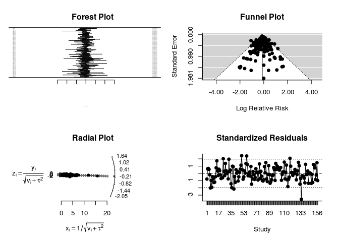 

Plot a L'Abbe plot.


```r
labbe(RR)
```

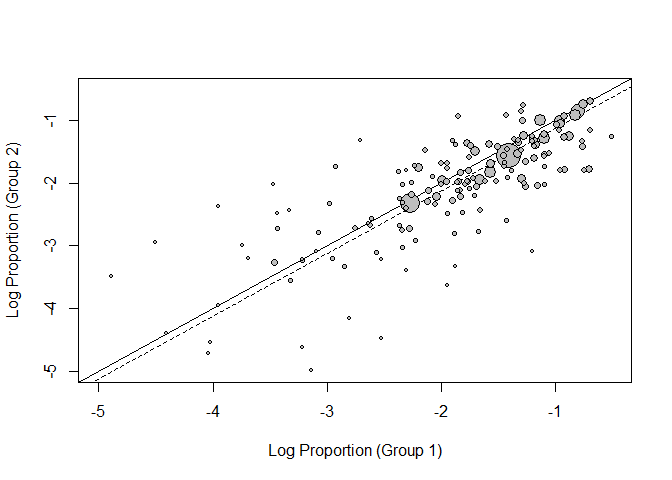 

Plot summary forest plot.


```r
forest(RR, slab=D$study, atransf=exp, ref=1)
```

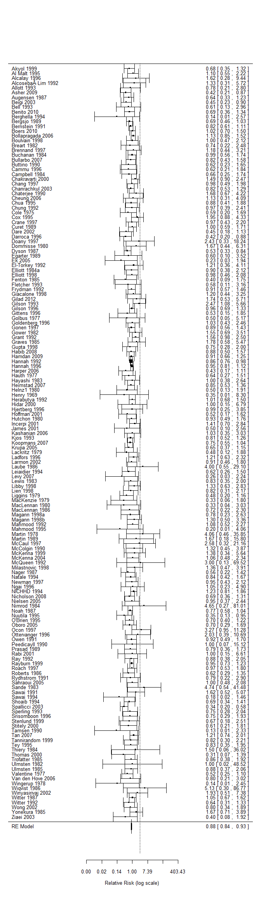 

Fit a random effects model for the relative difference.


```r
RD <- rma(measure="RD", data=D, ai=yInt, n1i=nInt, ci=yCntl, n2i=nCntl)
summary(RD)
```

```
## 
## Random-Effects Model (k = 157; tau^2 estimator: REML)
## 
##    logLik   deviance        AIC        BIC       AICc  
##  192.0801  -384.1603  -380.1603  -374.0606  -380.0819  
## 
## tau^2 (estimated amount of total heterogeneity): 0.0001 (SE = 0.0002)
## tau (square root of estimated tau^2 value):      0.0121
## I^2 (total heterogeneity / total variability):   7.59%
## H^2 (total variability / sampling variability):  1.08
## 
## Test for Heterogeneity: 
## Q(df = 156) = 185.9364, p-val = 0.0511
## 
## Model Results:
## 
## estimate       se     zval     pval    ci.lb    ci.ub          
##  -0.0130   0.0039  -3.3533   0.0008  -0.0206  -0.0054      *** 
## 
## ---
## Signif. codes:  0 '***' 0.001 '**' 0.01 '*' 0.05 '.' 0.1 ' ' 1
```

```r
predict(RD)
```

```
##     pred     se   ci.lb   ci.ub   cr.lb  cr.ub
##  -0.0130 0.0039 -0.0206 -0.0054 -0.0379 0.0119
```

Plot model diagnostics.


```r
plot(RD)
```

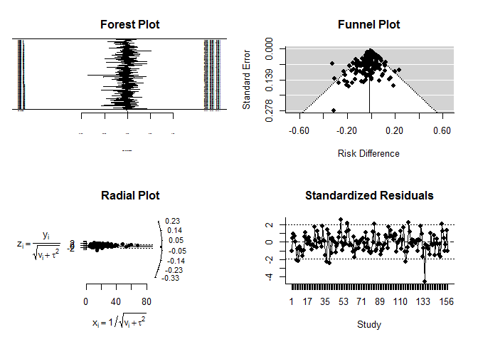 

Plot a L'Abbe plot.


```r
labbe(RD)
```

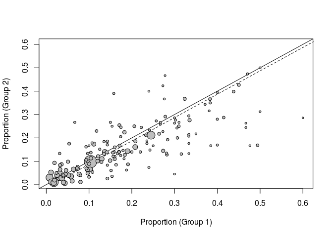 

Plot summary forest plot.


```r
forest(RD, slab=D$study, digits=4)
```

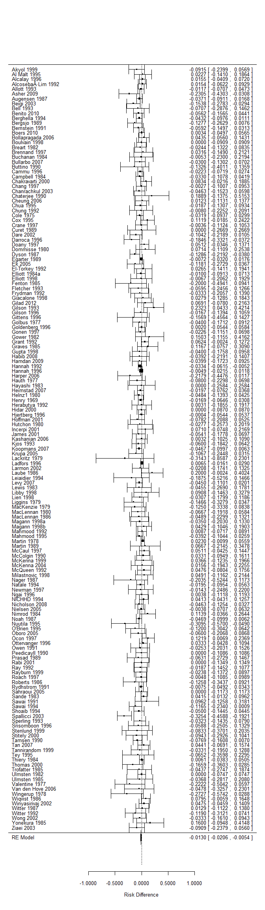 


# Using JAGS


Specify the model using JAGS syntax.
Write the model to a text file.
Show the model.


```r
cat(readLines(f), sep="\n")
```

```
## model
## {
##   # Likelihood
##   for( i in 1 : n ) {
##     z[i] ~ dnorm(0, 1)
##     logit(pInt[i] ) <- alpha + beta + sigma * z[i]
##     logit(pCntl[i]) <- alpha        + sigma * z[i]
##     yInt[i]  ~ dbin(pInt[i] , nInt[i] )
##     yCntl[i] ~ dbin(pCntl[i], nCntl[i])
##   }
##   # Priors
##   alpha ~ dnorm(0, 1.0E-1)
##   beta  ~ dnorm(0, 1.0E-1)
##   sigma ~ dnorm(1, 1.0E-1) I(0, )
##   # sigma ~ dgamma(0.001, 0.001)
## }
```

Prepare the data for JAGS.
`R2jags` requires the data object to be a list.


```r
D2 <- list(n=nrow(D), yInt=D$yInt, nInt=D$nInt, yCntl=D$yCntl, nCntl=D$nCntl)
```

Initialize the parameters.


```r
# inits <- function() {list("alpha"=rnorm(1), "beta"=rnorm(1), "sigma"=runif(1), "z"=rnorm(nrow(D)))}
inits <- NULL
```

Specify the parameters to track.


```r
params <- c("alpha", "beta", "sigma")
```

Set the random number seed.


```r
set.seed(as.numeric(as.Date("2014-08-27")))
```

Run the model.
**Don't use `jags()`;** it's slow.
Actually, use `jags()` and check the speed difference.


```r
system.time(M <- jags(D2, inits, params, model.file=f, n.iter=30E3))
```

```
## module glm loaded
```

```
## Compiling model graph
##    Resolving undeclared variables
##    Allocating nodes
##    Graph Size: 1577
## 
## Initializing model
```

```
##    user  system elapsed 
## 125.364   0.001 125.610
```

**Use `jags.parallel()` instead;** it's faster.
`jags.parallel` requires some counterintuitive specification.
See this tip on [Stackoverflow](http://stackoverflow.com/a/20156127).


```r
n <- nrow(D)
yInt <- D$yInt
nInt <- D$nInt
yCntl <- D$yCntl
nCntl <- D$nCntl
D3 <- list("n", "yInt", "nInt", "yCntl", "nCntl")
system.time(M <- jags.parallel(D3, inits, params, model.file=f, n.chains=3, n.iter=30E3))
```

```
##    user  system elapsed 
##   0.022   0.015 109.847
```

Convert the JAGS object to an MCMC object.
Also, convert the MCMC object to a ggs object.


```r
Mmcmc <- as.mcmc(M)
Mggs <- ggs(as.mcmc(M))
```

Check for convergence.


```r
ggs_traceplot(Mggs)
```

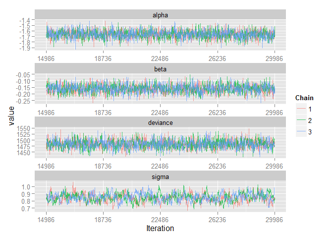 

```r
ggs_autocorrelation(Mggs)
```

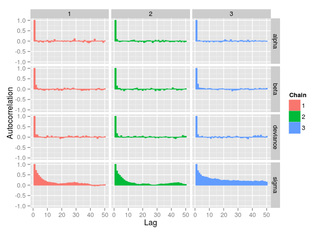 

```r
ggs_compare_partial(Mggs)
```

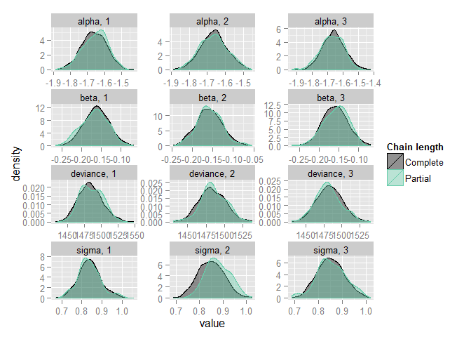 

**Convergence looks good.**
So, show the model output.


```r
M
```

```
## Inference for Bugs model at "/tmp/RtmpqNJtGk/file4bef2c37db1f", fit using jags,
##  3 chains, each with 30000 iterations (first 15000 discarded), n.thin = 15
##  n.sims = 3000 iterations saved
##           mu.vect sd.vect     2.5%      25%      50%      75%    97.5%
## alpha      -1.661   0.074   -1.808   -1.710   -1.662   -1.612   -1.516
## beta       -0.160   0.032   -0.224   -0.181   -0.161   -0.139   -0.098
## sigma       0.839   0.056    0.736    0.800    0.837    0.876    0.953
## deviance 1483.238  18.670 1448.657 1470.191 1482.517 1495.716 1521.610
##           Rhat n.eff
## alpha    1.001  3000
## beta     1.002  1100
## sigma    1.013   160
## deviance 1.001  3000
## 
## For each parameter, n.eff is a crude measure of effective sample size,
## and Rhat is the potential scale reduction factor (at convergence, Rhat=1).
## 
## DIC info (using the rule, pD = var(deviance)/2)
## pD = 174.3 and DIC = 1657.6
## DIC is an estimate of expected predictive error (lower deviance is better).
```

```r
ggs_density(Mggs)
```

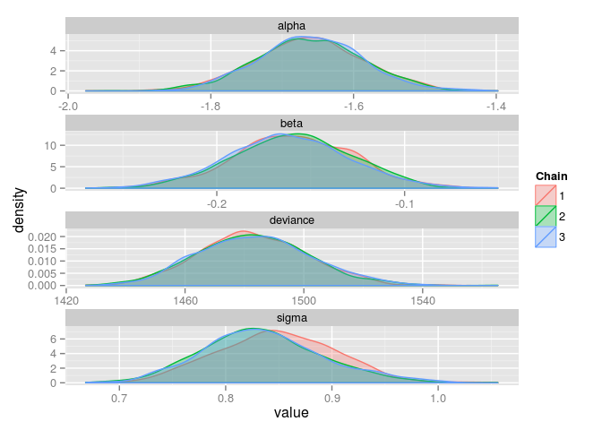 

Combine the MCMC chains.
Calculate some useful output from the model.


```r
Mdf <- rbind(data.frame(chain = 1, Mmcmc[[1]]),
             data.frame(chain = 2, Mmcmc[[2]]),
             data.frame(chain = 3, Mmcmc[[3]]))
Mdf$predInt <- exp(Mdf$alpha + Mdf$beta) / (1 + exp(Mdf$alpha + Mdf$beta))
Mdf$predCntl <- exp(Mdf$alpha) / (1 + exp(Mdf$alpha))
Mdf$rateInt <- Mdf$predInt * denominator
Mdf$rateCntl <- Mdf$predCntl * denominator
Mdf$rateDiff <- Mdf$rateInt - Mdf$rateCntl
Mdf$nns <- 1 / (Mdf$predCntl - Mdf$predInt)
```

Summarize.


```r
Mgg <- melt(Mdf, id.vars=c("chain"), measure.vars=c("rateInt", "rateCntl", "rateDiff", "nns"))
Mgg$varLabel <- factor(Mgg$variable, labels=c("Intervention", "Control", "Difference", "NNS"))
ggplot(Mgg[Mgg$varLabel %in% c("Intervention", "Control"), ], aes(x=value, fill=varLabel)) +
  geom_density(alpha=1/2) +
  scale_x_continuous(sprintf("Rate per %s", format(denominator, big.mark=","))) +
  scale_y_continuous("Density") +
  scale_fill_discrete("")
```

 

```r
ggplot(Mgg[Mgg$varLabel == "Difference", ], aes(x=value)) +
  geom_density(alpha=1/2, fill="grey") +
  scale_x_continuous(sprintf("Rate difference per %s", format(denominator, big.mark=","))) +
  scale_y_continuous("Density") +
  scale_fill_discrete("") +
  geom_vline(xIntercept = 0)
```

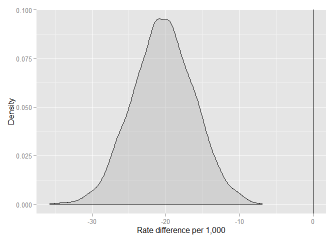 

Save the JAGS objects.


```r
modelJAGS <- list(metadata = list(timestamp = Sys.time(),
                                  R = R.version.string,
                                  R2jags = packageVersion("R2jags")),
                  jags = M,
                  chains = Mdf)
save(modelJAGS, file="modelJAGS.RData")
```


# Session info


```
## Start time: 2015-09-03 04:54:40
## End time: 2015-09-03 04:58:42
```

```
## Time difference of 4.043809 mins
```

```
##                                       sysname 
##                                       "Linux" 
##                                       release 
##                           "3.13.0-55-generic" 
##                                       version 
## "#94-Ubuntu SMP Thu Jun 18 00:27:10 UTC 2015" 
##                                      nodename 
##                            "ip-172-31-46-191" 
##                                       machine 
##                                      "x86_64" 
##                                         login 
##                                     "unknown" 
##                                          user 
##                                     "rstudio" 
##                                effective_user 
##                                     "rstudio"
```

```
## R version 3.2.1 (2015-06-18)
## Platform: x86_64-pc-linux-gnu (64-bit)
## Running under: Ubuntu 14.04.2 LTS
## 
## attached base packages:
## [1] stats     graphics  grDevices utils     datasets  methods   base     
## 
## other attached packages:
##  [1] ggmcmc_0.7.1     GGally_0.5.0     tidyr_0.2.0      ggplot2_1.0.1   
##  [5] dplyr_0.4.3      Rcpp_0.12.0      R2jags_0.5-7     rjags_3-10      
##  [9] coda_0.16-1      lattice_0.20-31  metafor_1.9-7    Matrix_1.2-0    
## [13] reshape2_1.4.1   data.table_1.9.4 curl_0.9.3      
## 
## loaded via a namespace (and not attached):
##  [1] formatR_1.2      plyr_1.8.3       tools_3.2.1      boot_1.3-16     
##  [5] digest_0.6.8     evaluate_0.7.2   gtable_0.1.2     DBI_0.3.1       
##  [9] yaml_2.1.13      parallel_3.2.1   proto_0.3-10     stringr_1.0.0   
## [13] knitr_1.11       grid_3.2.1       reshape_0.8.5    R6_2.1.1        
## [17] rmarkdown_0.8    magrittr_1.5     scales_0.3.0     R2WinBUGS_2.1-21
## [21] htmltools_0.2.6  MASS_7.3-41      abind_1.4-3      assertthat_0.1  
## [25] colorspace_1.2-6 labeling_0.3     stringi_0.5-5    lazyeval_0.1.10 
## [29] munsell_0.4.2    chron_2.3-47
```
