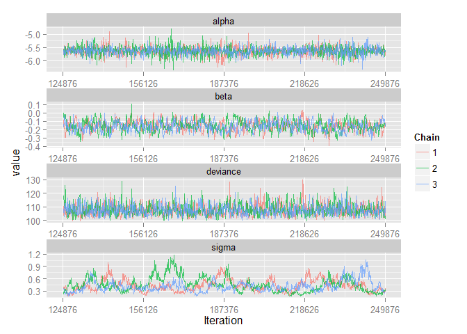
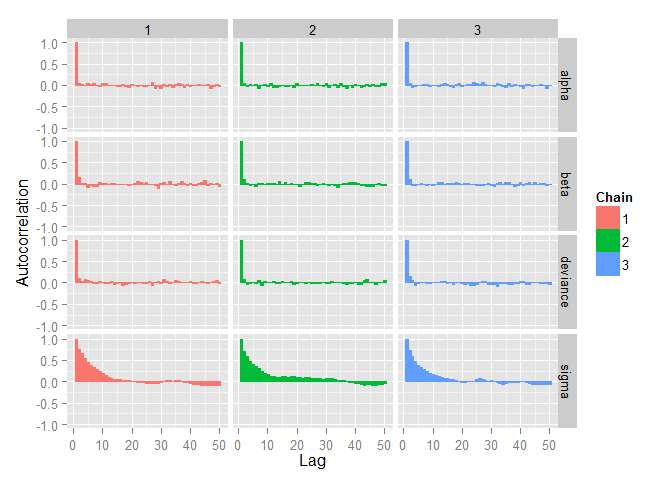
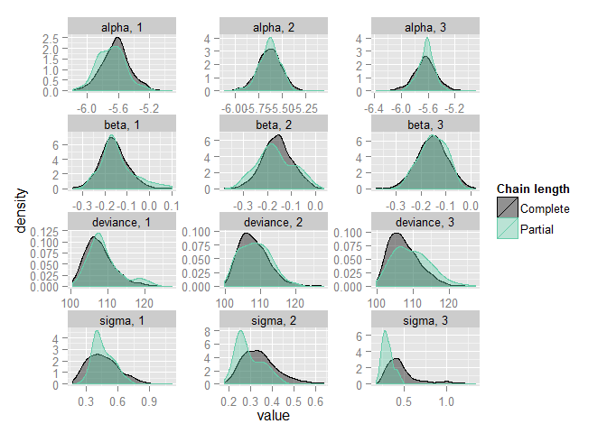
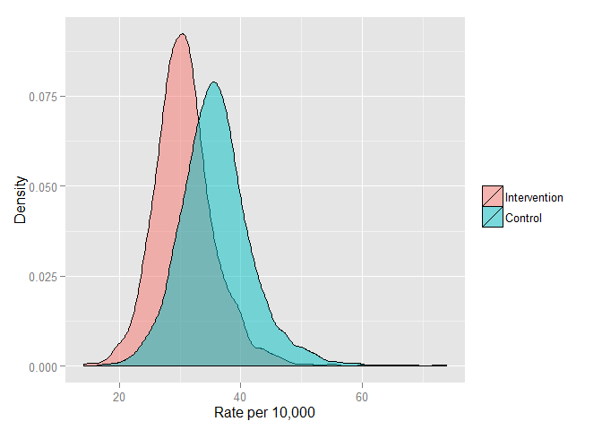
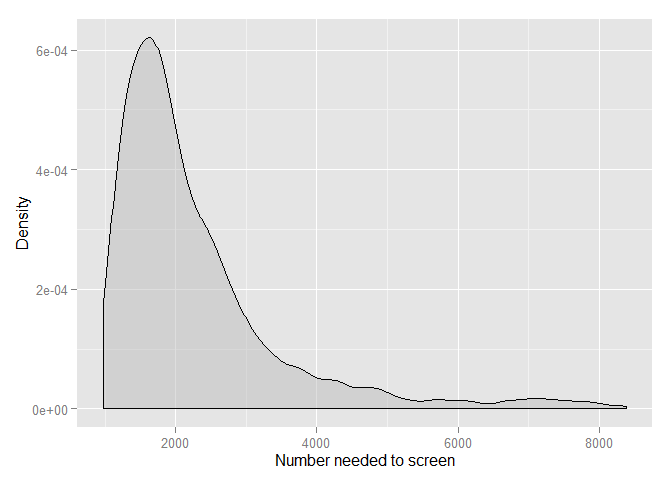

# Long term adverse events after breast cancer adjuvant chemotherapy
Benjamin Chan  

Last update: 2014-08-29 20:27:46

R version: R version 3.1.1 (2014-07-10)


Recreate the analysis from Nelson (2009); Screening for Breast Cancer: An Update for the U.S. Preventive Services Task Force; Ann Intern Med. 2009;151:727-737.

Here's the dataset from the figure on page 730.


```r
study <- c('AGE', 'CNBSS-1', 'HIP', 'Gothenburg', 'Stockholm', 'Malmo', 'Kopparberg', 'Ostergotland')
yInt   <- c(    105,    105,     64,     34,     34,     53,     22,     31)
nInt   <- c(  53884,  25214,  13740,  11724,  14303,  13568,   9582,  10285)
pyInt  <- c( 578390, 282606, 192360,     NA, 203000, 184000, 124566, 172000)
yCntl  <- c(    251,    108,     82,     59,     13,     66,     16,     30)
nCntl  <- c( 106956,  25216,  13740,  14217,   8021,  12279,   5031,  10459)
pyCntl <- c(1149380, 282575, 192360,     NA, 117000, 160000,  65403, 176000)
denominator <- 10000
rateInt  <- denominator * yInt  / nInt
rateCntl <- denominator * yCntl / nCntl
rr <- rateInt / rateCntl
rd <- rateInt - rateCntl
nns <- 1 / ((yCntl / nCntl) - (yInt / nInt))
D <- data.frame(study,
                yInt , nInt , pyInt , rateInt ,
                yCntl, nCntl, pyCntl, rateCntl,
                rr, rd, nns)
D
```

```
##          study yInt  nInt  pyInt rateInt yCntl  nCntl  pyCntl rateCntl
## 1          AGE  105 53884 578390   19.49   251 106956 1149380    23.47
## 2      CNBSS-1  105 25214 282606   41.64   108  25216  282575    42.83
## 3          HIP   64 13740 192360   46.58    82  13740  192360    59.68
## 4   Gothenburg   34 11724     NA   29.00    59  14217      NA    41.50
## 5    Stockholm   34 14303 203000   23.77    13   8021  117000    16.21
## 6        Malmo   53 13568 184000   39.06    66  12279  160000    53.75
## 7   Kopparberg   22  9582 124566   22.96    16   5031   65403    31.80
## 8 Ostergotland   31 10285 172000   30.14    30  10459  176000    28.68
##       rr      rd     nns
## 1 0.8303  -3.981  2511.7
## 2 0.9723  -1.186  8428.7
## 3 0.7805 -13.100   763.3
## 4 0.6988 -12.499   800.0
## 5 1.4667   7.564 -1322.1
## 6 0.7267 -14.688   680.8
## 7 0.7219  -8.843  1130.8
## 8 1.0508   1.458 -6860.8
```


# Using random-effects model

**Do not run**


# Using JAGS


Load `R2jags` and `ggmcmc`.


```r
require(R2jags, quietly=TRUE)
```

```
## Loading required package: coda
## Loading required package: lattice
## Linked to JAGS 3.4.0
## Loaded modules: basemod,bugs
## 
## Attaching package: 'R2jags'
## 
## The following object is masked from 'package:coda':
## 
##     traceplot
```

```r
require(ggmcmc, quietly=TRUE)
```

Specify the model using JAGS syntax.
Write the model to a text file.


```r
cat("model
{
  # Likelihood
  for( i in 1 : n ) {
    z[i] ~ dnorm(0, 1)
    logit(pInt[i] ) <- alpha + beta + sigma * z[i]
    logit(pCntl[i]) <- alpha        + sigma * z[i]
    yInt[i]  ~ dbin(pInt[i] , nInt[i] )
    yCntl[i] ~ dbin(pCntl[i], nCntl[i])
  }
  # Priors
  alpha ~ dnorm(-5.0, 1.0E-1)
  beta  ~ dnorm(0.5, 1.0E-1)
  sigma ~ dnorm( 0.5, 1.0E-1) I(0, )
  # sigma ~ dgamma(0.001, 0.001)
}
",
file="modelMetaAnalysis.txt")
```

Prepare the data for JAGS.
`R2jags` requires the data object to be a list.


```r
D2 <- list(n=nrow(D), yInt=D$yInt, nInt=D$nInt, yCntl=D$yCntl, nCntl=D$nCntl)
```

Initialize the parameters.


```r
# inits <- function() {list("alpha"=rnorm(1), "beta"=rnorm(1), "sigma"=runif(1), "z"=rnorm(nrow(D)))}
inits <- NULL
```

Specify the parameters to track.


```r
params <- c("alpha", "beta", "sigma")
```

Set the random number seed.


```r
set.seed(as.numeric(as.Date("2014-08-27")))
```

Run the model.
**Don't use `jags()`.**


```r
system.time(M <- jags(D2, inits, params, model.file="modelMetaAnalysis.txt", n.iter=250E3))
```

**Use `jags.parallel()` instead;** it's faster.
`jags.parallel` requires some counterintuitive specification.
See this tip on [Stackoverflow](http://stackoverflow.com/a/20156127).


```r
n <- nrow(D)
D3 <- list("n", "yInt", "nInt", "yCntl", "nCntl")
system.time(M <- jags.parallel(D3, inits, params, model.file="modelMetaAnalysis.txt", n.chains=3, n.iter=250E3))
```

```
##    user  system elapsed 
##    0.05    0.02   32.13
```

Convert the JAGS object to an MCMC object.
Also, convert the MCMC object to a ggs object.


```r
Mmcmc <- as.mcmc(M)
Mggs <- ggs(as.mcmc(M))
```

Check for convergence.


```r
ggs_traceplot(Mggs)
```

 

```r
ggs_autocorrelation(Mggs)
```

 

```r
ggs_compare_partial(Mggs)
```

 

**Convergence looks good.**
So, show the model output.


```r
M
```

```
## Inference for Bugs model at "modelMetaAnalysis.txt", fit using jags,
##  3 chains, each with 250000 iterations (first 125000 discarded), n.thin = 125
##  n.sims = 3000 iterations saved
##          mu.vect sd.vect    2.5%     25%     50%     75%   97.5%  Rhat
## alpha     -5.638   0.165  -5.981  -5.739  -5.634  -5.537  -5.308 1.004
## beta      -0.159   0.063  -0.283  -0.203  -0.161  -0.117  -0.034 1.007
## sigma      0.433   0.153   0.220   0.325   0.403   0.507   0.815 1.018
## deviance 107.689   4.094 101.583 104.702 107.041 110.053 116.933 1.004
##          n.eff
## alpha     3000
## beta       410
## sigma      240
## deviance   780
## 
## For each parameter, n.eff is a crude measure of effective sample size,
## and Rhat is the potential scale reduction factor (at convergence, Rhat=1).
## 
## DIC info (using the rule, pD = var(deviance)/2)
## pD = 8.4 and DIC = 116.1
## DIC is an estimate of expected predictive error (lower deviance is better).
```

```r
ggs_density(Mggs)
```

 

Combine the MCMC chains.
Calculate some useful output from the model.


```r
Mdf <- rbind(data.frame(chain = 1, Mmcmc[[1]]),
             data.frame(chain = 2, Mmcmc[[2]]),
             data.frame(chain = 3, Mmcmc[[3]]))
Mdf$predInt <- exp(Mdf$alpha + Mdf$beta) / (1 + exp(Mdf$alpha + Mdf$beta))
Mdf$predCntl <- exp(Mdf$alpha) / (1 + exp(Mdf$alpha))
Mdf$rateInt <- Mdf$predInt * denominator
Mdf$rateCntl <- Mdf$predCntl * denominator
Mdf$rateDiff <- Mdf$rateInt - Mdf$rateCntl
Mdf$nns <- 1 / (Mdf$predCntl - Mdf$predInt)
```

Summarize.


```r
Mgg <- melt(Mdf, id.vars=c("chain"), measure.vars=c("rateInt", "rateCntl", "rateDiff", "nns"))
Mgg$varLabel <- factor(Mgg$variable, labels=c("Intervention", "Control", "Difference", "NNS"))
ggplot(Mgg[Mgg$varLabel %in% c("Intervention", "Control"), ], aes(x=value, fill=varLabel)) +
  geom_density(alpha=1/2) +
  scale_x_continuous(sprintf("Rate per %s", format(denominator, big.mark=","))) +
  scale_y_continuous("Density") +
  scale_fill_discrete("")
```

 

```r
ggplot(Mgg[Mgg$varLabel == "Difference", ], aes(x=value)) +
  geom_density(alpha=1/2, fill="grey") +
  scale_x_continuous(sprintf("Rate difference per %s", format(denominator, big.mark=","))) +
  scale_y_continuous("Density") +
  scale_fill_discrete("") +
  geom_vline(xIntercept = 0)
```

 

```r
nnsBounds <- quantile(Mgg[Mgg$varLabel == "NNS", "value"], probs=c(0.025, 0.975))
ggplot(Mgg[Mgg$varLabel == "NNS" & Mgg$value > nnsBounds[1] & Mgg$value < nnsBounds[2], ], aes(x=value)) +
  geom_density(alpha=1/2, fill="grey") +
  scale_x_continuous("Number needed to screen") +
  scale_y_continuous("Density") +
  scale_fill_discrete("")
```

 

Save the JAGS objects.


```r
modelJAGS <- list(metadata = list(timestamp = Sys.time(),
                                  R = R.version.string,
                                  R2jags = packageVersion("R2jags")),
                  jags = M,
                  chains = Mdf)
save(modelJAGS, file="modelJAGS.RData")
```
